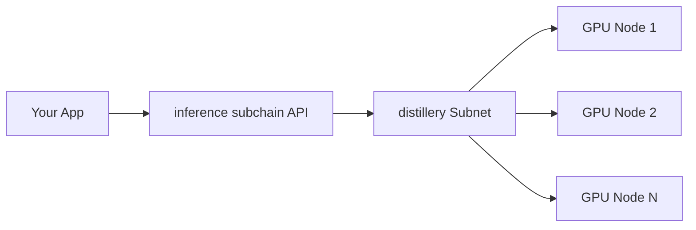

# Core Concepts

## Core Concepts of the inference subchain

Let's pull back the curtain and take a peek at what makes the inference subchain tick. Don't worry, we won't get too deep into the weeds - just enough to give you a solid understanding of how your requests turn into AI-powered responses.

### The Big Picture

At its heart, the inference subchain is all about connecting you, the developer, with a distributed network of AI processing power. Here's how it fits into the bigger Gintonic ecosystem:

### How It Works

1. **API Layer**: This is where you come in. You send requests to our API, just like you would with any other cloud AI service.
2. **Request Routing**: The inference subchain takes your request and figures out the best way to process it. It's like a traffic cop for AI tasks.
3. **Distillery Subnet**: This is where the magic happens. Your request gets broken down and distributed across a network of GPU-powered nodes.
4. **Processing**: Each node crunches its part of the task. It's like a bunch of mini-brains working together on your problem.
5. **Response Aggregation**: The inference subchain collects all the pieces, puts them back together, and sends you the final result.

### The Secret Sauce: [distillery Subnet](../live-subchains/distillery-intro.md)

The distillery subchain is what sets us apart from traditional, centralized AI services. It's a network of distributed GPU nodes that work together to process your requests. Here's why it's awesome:

* **Cost-Efficient**: We only use the resources we need, when we need them. No idle servers eating up costs.
* **Scalable**: Need more power? The network can easily expand to meet demand.
* **Resilient**: If one node goes down, the others can pick up the slack.

### Supported Models

We're starting with a bang:

#### [Mistral LLM](https://docs.mistral.ai/)

Mistral is our first supported model, and it's a powerhouse. It's great for:

* Text generation
* Question answering
* Summarization
* And much more!

We're not stopping there, though. We've got plans to add more cutting-edge models to our lineup. Stay tuned!

#### Model Configuration Parameters

* **Repetition Penalty**: Encourages more diverse text by penalizing the use of duplicate tokens. This helps reduce repetition in the model's output. The optimal value is often around 1.2, but you can adjust it as needed.
* **Top P**: Limits the selection of words to a certain accumulated probability threshold. For example, if top\_p is 0.5, only the most probable words whose cumulative probability exceeds 0.5 will be considered.

These parameters help the model generate more plausible and varied texts by avoiding unlikely or overly predictable words.

### Understanding Tokens

When you're using the inference subchain, you'll hear a lot about "tokens". Here's the lowdown:

* A token is roughly equivalent to 4 characters or 0.75 words.
* Both your input and the model's output are measured in tokens.
* The more tokens, the more processing power needed (and the more it costs).


Keep an eye on your token usage to optimize your costs. We provide tools to help you track this - check out the [Billing and Usage](billing-and-usage.md) section for more info.


### Putting It All Together

Let's walk through a typical request:

1. You send a prompt to generate a story about _a robot learning to paint_.
2. The inference subchain receives your request and tokenizes it.
3. The request is routed to the [distillery subchain](../live-subchains/distillery-intro.md).
4. Multiple GPU nodes work together to process your request using the Mistral LLM.
5. The generated story is sent back to you.

All of this happens in seconds, and you only pay for the tokens you use.

### What's Next?

Now that you've got a handle on the core concepts, you're ready to dive deeper:

* Check out our API Reference to see all the ways you can interact with the inference subchain.
* Learn some Best Practices to get the most out of the service.
* Curious about the nitty-gritty details? Our Advanced Topics section is for you.

Remember, we're here to make AI accessible and affordable. If anything's still unclear, drop us a line in [Discord](https://discord.gg/hm6PYe5W). Happy inferencing!
